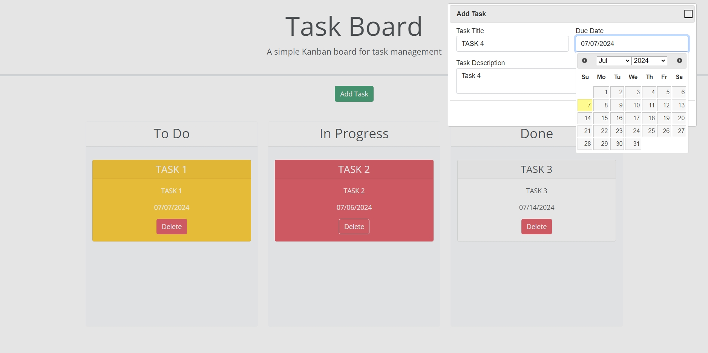
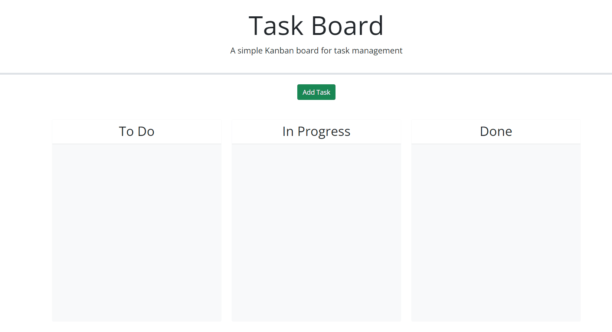

# kanban-task-board

05-Third-Party-APIs/02-Challenge: Kanban project board with draggable task cards

## Description

Module 5 - Third Party APIs: Kanban Task Board

Development of HTML and JavaScript using Bootstrap, JQuery and JQuery UI to create a organisational kanban task board, through the execution of the following:

- fillable form in popup dialog and clickable form submit
- storage of form data into local storage for multi-task rendering
- creating a unique id for each task entry
- draggable task cards to facilitate kanban organisation
- automatic colour coding of task cards based on due day using dayjs
- ability to delete individual task cards

Project executed in accordance with the following challenge requirements:

### User Story

```md
AS A project team member with multiple tasks to organize
I WANT a task board 
SO THAT I can add individual project tasks, manage their state of progress and track overall project progress accordingly
```

### Acceptance Criteria

```md
GIVEN a task board to manage a project
WHEN I open the task board
THEN the list of project tasks is displayed in columns representing the task progress state (Not Yet Started, In Progress, Completed)
WHEN I view the task board for the project
THEN each task is color coded to indicate whether it is nearing the deadline (yellow) or is overdue (red)
WHEN I click on the button to define a new task
THEN I can enter the title, description and deadline date for the new task into a modal dialog
WHEN I click the save button for that task
THEN the properties for that task are saved in localStorage
WHEN I drag a task to a different progress column
THEN the task's progress state is updated accordingly and will stay in the new column after refreshing
WHEN I click the delete button for a task
THEN the task is removed from the task board and will not be added back after refreshing
WHEN I refresh the page
THEN the saved tasks persist
```

## Table of Contents

- [Installation](#installation)
- [Usage](#usage)
- [Credits](#credits)
- [License](#license)

## Installation

Git and an IDE (VSCode recommended) are required to be installed on your computer to clone and view the code for this web application.

From your command line:

```md
### Clone this repository
$ git clone git@github.com:ajhearne-mZAOSW/kanban-task-board.git

### Navigate into the repository
$ cd kanban-task-board

### Open in IDE
$ code .
```

## Usage

The following image shows the web application's appearance and functionality:





The web application is depoloyed using GitHub Pages: (<https://ajhearne-mzaosw.github.io/kanban-task-board/>).

## Credits

- Source starter code provided by University of Sydney, USYD-VIRT-FSF-PT-05-2024-U-LOLC/05-Third-Party-APIs/02-Challenge/Develop

## License

MIT
